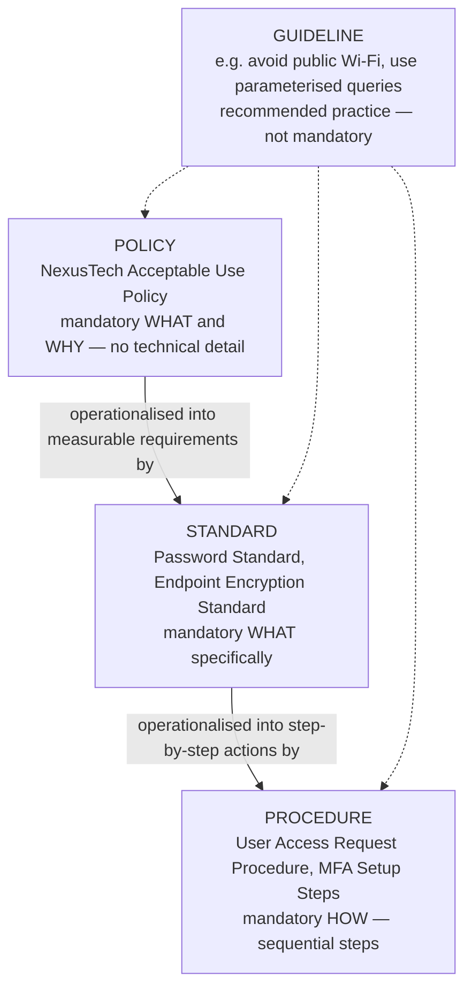

# NexusTech Solutions — Security Policy Development Lab

**Course:** GRC102 — Information Security Governance | Module 2: Developing Security Policies and Procedures
**Week:** Week 2 (12–18 September 2026)
**Role:** Information Security Manager (simulated)

> 📁 Part of my GRC / Information Security Governance coursework portfolio.

## Introduction

This repository documents my work on a scenario-based information security governance lab, where I took on the role of a newly appointed Information Security Manager tasked with replacing a messy, informally maintained "IT Rules" document with a proper, layered security policy framework. The exercise covers the full lifecycle of practical policy development: distinguishing policy types, writing an enforceable Acceptable Use Policy, operationalising it into a step-by-step access-request procedure, planning its organisational rollout, and knowing when and how to revise it as the business changes.

All company names, individuals and incidents referenced below are fictional and used solely for the purposes of this simulated exercise.

## Lab Scenario

Welcome to **NexusTech Solutions**, a rapidly growing mid-sized software development company specialising in cloud-based enterprise resource planning (ERP) systems. The organisation has expanded from 50 to 250 employees and has recently acquired high-profile clients in the **financial and healthcare sectors**.

Having been appointed Information Security Manager, I discovered that the company still relied on a five-year-old "IT Rules" document that mixed high-level policy intent, technical configuration instructions and vague recommendations all in one place. This had created inconsistent practices, unclear accountability and compliance gaps across the organisation.

CEO **Marcus Vance** directed the establishment of a formal, structured and maintainable information security policy framework — one that could strengthen governance, support **ISO/IEC 27001** and **SOC 2** readiness, and protect the company's growing information assets as it takes on clients with stricter regulatory and contractual expectations.

Every artefact in this lab was produced as if suitable for management review and realistic organisational use, not as a purely theoretical exercise.

## Skills Demonstrated

- **Policy governance structuring** — applied the Policy → Standard → Procedure → Guideline hierarchy to a real-world SaaS/ERP scenario, correctly classifying ambiguous draft statements by authority and level of detail.
- **Enforceable policy writing** — drafted an Acceptable Use Policy using clear, mandatory language (not vague or technical instructions), covering acceptable use, prohibited activities, and reasonable personal use.
- **Procedure design** — translated a policy requirement into a sequential, action-oriented procedure (User Access Request Procedure) usable by frontline staff, including least-privilege checks and emergency-access handling.
- **Security framework alignment** — mapped policy requirements to ISO/IEC 27001:2022 and SOC 2 Trust Services Criteria to support audit and client-readiness objectives.
- **Change management & communication planning** — built a multi-audience rollout plan (employees, IT, leadership, contractors) with defined channels, acknowledgement mechanisms, and measurable success criteria.
- **Governance reporting** — wrote a concise, decision-ready Policy Review Memo to a steering committee, linking infrastructure change and incident data to specific, actionable policy updates.
- **Risk-based judgement** — identified review triggers (cloud migration, data-handling incident) and proposed proportionate, targeted control updates rather than a blanket policy rewrite.

---

> The sections below answer every task in the lab brief in question → answer format, with supporting tables and a diagram.

## Table of Contents
- [Task 1 - Establish the Security Policy Hierarchy](#task-1---establish-the-security-policy-hierarchy)
- [Task 2 - Acceptable Use Policy](#task-2---acceptable-use-policy)
- [Task 3 - User Access Request Procedure](#task-3---user-access-request-procedure)
- [Task 4 - Communication and Training Plan](#task-4---communication-and-training-plan)
- [Task 5 - Policy Review and Maintenance Memo](#task-5---policy-review-and-maintenance-memo)
---

## Task 1 — Establish the Security Policy Hierarchy

### 1.1 Hierarchy Definition Table

**Question:** Define Policy, Standard, Guideline and Procedure, including purpose, authority, mandatory/recommended nature and level of detail.

**Answer:**

| Document Type | Purpose | Authority | Mandatory / Recommended | Level of Detail |
|---|---|---|---|---|
| **Policy** | States WHAT must happen and WHY — high-level management intent and direction for a topic area. | Approved by CEO / Executive Leadership. | Mandatory | High-level; no technical detail or step-by-step instruction. |
| **Standard** | States the specific, measurable requirement that must be met to satisfy a policy. | Approved by the Information Security Manager (ISM) / IT Security function. | Mandatory | Specific technical thresholds, tools or configurations named. |
| **Guideline** | Offers recommended good practice to help staff make sound decisions; interprets policy intent. | Issued by IT Security as advisory guidance. | Recommended (not mandatory) | Practical advice, tips, suggested approaches. |
| **Procedure** | States HOW to carry out a task, step-by-step, to meet a standard or policy requirement. | Owned by the operational team performing the task (e.g., Helpdesk, IT Ops). | Mandatory for the specific task it governs | Highly detailed, sequential, action-oriented steps. |

### 1.2 Statement Categorisation

**Question:** Classify all eight draft statements from the Documentation Brainstorming List, with a one-sentence justification for each.

**Answer:**

| # | Draft Statement | Classification | Justification |
|---|---|---|---|
| 1 | All NexusTech employees must use multi-factor authentication (MFA) when accessing the corporate network remotely. | **Policy** | States a mandatory high-level requirement ("must use MFA") without specifying any technical configuration steps — this is management intent, not an instruction. |
| 2 | To configure MFA on your mobile device, download the Authenticator app, scan the QR code provided in the IT portal, and enter the six-digit verification code. | **Procedure** | A precise, sequential, action-oriented set of steps a user follows to complete a task — the defining trait of a procedure. |
| 3 | It is recommended that developers use parameterised queries to reduce SQL injection risk. | **Guideline** | Uses advisory language ("it is recommended") rather than mandatory language, and offers a best-practice suggestion rather than an enforceable rule. |
| 4 | NexusTech is committed to protecting the confidentiality, integrity and availability of all client data. | **Policy** | A broad statement of organisational intent and principle with no technical detail — foundational policy language. |
| 5 | All corporate laptops must have full-disk encryption enabled using BitLocker (Windows) or FileVault (macOS). | **Standard** | Mandatory, but specifies the exact technical control and named tools required to satisfy a broader data-protection policy — the hallmark of a standard. |
| 6 | Employees should avoid connecting to public, unsecured Wi-Fi networks when travelling. | **Guideline** | Uses soft, advisory language ("should avoid") rather than a mandatory directive. |
| 7 | In the event of a suspected security breach, employees must immediately contact the IT Helpdesk at extension 5555. | **Procedure** | Although phrased with mandatory language, it is a single, specific, actionable instruction — the first step of an Incident Reporting Procedure. |
| 8 | Passwords must be a minimum of 14 characters and contain at least one uppercase letter, one lowercase letter, one number and one special character. | **Standard** | A mandatory, precisely measurable technical parameter that operationalises a broader Access Control / Password Policy requirement. |

### 1.3 Hierarchy Diagram

**Question:** Create a simple hierarchy diagram showing how policy flows into standards, procedures and guidelines.

**Answer:**

In short: **Policy** states intent → **Standards** make it measurable → **Procedures** make it repeatable, while **Guidelines** offer supporting advice at every level without adding a mandatory obligation.

---

## Task 2 — Acceptable Use Policy

**Question:** Draft a complete Acceptable Use Policy (AUP) for NexusTech covering acceptable use, prohibited activities, reasonable personal use, roles, compliance/enforcement, exceptions and approval — written as enforceable policy statements, not a technical procedure.

**Answer:**

### Document Control

| Field | Detail |
|---|---|
| Title | Acceptable Use Policy |
| Version | 1.0 |
| Policy Owner | Information Security Manager |
| Approval Authority | Marcus Vance, Chief Executive Officer |
| Effective Date | 22 September 2026 |
| Review Date | 22 September 2027 |

### 1. Purpose
This Policy defines the acceptable and prohibited use of NexusTech Solutions' devices, network, accounts, applications and digital resources. It protects the confidentiality, integrity and availability of NexusTech and client information — including the financial and healthcare client data NexusTech now processes — and supports NexusTech's ISO/IEC 27001 and SOC 2 readiness objectives.

### 2. Scope
This Policy applies to all NexusTech employees, contractors and interns who use NexusTech-owned or NexusTech-provisioned devices, network, accounts, applications or cloud services, regardless of location.

### 3. Policy Statements

**3.1 Acceptable Use**
- Use NexusTech-provided devices, accounts, network and cloud resources primarily to perform assigned job duties and support delivery of NexusTech's ERP products and services.
- Access only the systems and data required to perform your role, consistent with the principle of least privilege.
- Keep company-issued devices physically secure and promptly report lost, stolen or compromised devices to the IT Helpdesk.
- Use company-sanctioned collaboration and cloud storage tools for all work-related files, including client data.

**3.2 Prohibited Activities**
- Installing, downloading or executing unauthorised, unlicensed or unapproved software on company devices.
- Disabling, bypassing or tampering with security controls, including anti-malware, disk encryption, firewall or endpoint monitoring agents.
- Sharing login credentials, MFA codes or access tokens with any other person, including colleagues.
- Storing, transmitting or synchronising NexusTech or client data (including financial or healthcare client data) to personal cloud storage, personal email, or any non-approved third-party service.
- Connecting to NexusTech's corporate network or systems over public, unsecured Wi-Fi without first establishing an approved VPN connection.
- Using NexusTech systems, network or accounts for illegal activity, harassment, discrimination, or personal commercial gain.

**3.3 Reasonable Personal Use**
- Limited, incidental personal use of NexusTech devices and network (e.g., checking personal email or browsing) is permitted provided it does not interfere with job duties, consume disproportionate system resources, or violate any other provision of this Policy.

### 4. Roles and Responsibilities
| Role | Responsibility |
|---|---|
| All Users (Employees, Contractors, Interns) | Comply with this Policy, use resources responsibly, and promptly report suspected violations or security incidents. |
| IT / Information Security Team | Provision and monitor systems, enforce technical controls (e.g., DLP, endpoint monitoring), and investigate suspected violations. |
| Managers / Team Leads | Reinforce Policy expectations within their teams and support enforcement of appropriate consequences for violations. |
| Human Resources (HR) | Administer disciplinary action for confirmed violations in coordination with IT Security and the employee's manager. |

### 5. Compliance and Enforcement
Compliance is monitored through endpoint management, data-loss prevention (DLP) tooling and periodic audit. This Policy supports alignment with **ISO/IEC 27002:2022 control 5.10** (Acceptable use of information and other associated assets) and **SOC 2 Trust Services Criteria CC6** (Logical and Physical Access Controls).

Violations are addressed through a graduated response — verbal warning, written warning, mandatory retraining, suspension of access — up to and including termination of employment or contract, and referral to law enforcement where unlawful activity is involved. Serious violations, such as unauthorised transmission of client financial or healthcare data outside approved systems, may result in immediate termination and legal action.

### 6. Exceptions
Any request for an exception to this Policy must be submitted in writing to the Information Security Manager, including business justification and proposed compensating controls. Exceptions are time-bound, documented in the Exception Register, and require Information Security Manager approval; exceptions materially increasing risk to client data require additional approval from the CEO.

### 7. Approval

| Approved By | Title | Date |
|---|---|---|
| Marcus Vance | Chief Executive Officer | 22 September 2026 |

---

## Task 3 — User Access Request Procedure

**Question:** Develop a step-by-step User Access Request Procedure a Helpdesk technician can follow consistently, covering purpose/scope, prerequisites, request intake, approval verification, account creation, least-privilege permission assignment, notification, evidence capture, emergency handling, and record retention.

**Answer:**

### Purpose and Scope
This Procedure operationalises the Access Control Policy by defining the exact steps NexusTech IT Helpdesk technicians must follow to process any request for access to NexusTech systems, applications or data. It applies to all new-access, change-of-access and access-removal requests for employees, contractors and interns.

### Prerequisites
- Requestor must be an active NexusTech employee/contractor confirmed in the HR system, or a manager acting on their behalf.
- Target system must appear on the approved Systems and Role-Based Access Control (RBAC) Matrix maintained by IT Security.
- A named Data Owner must exist for any system holding client financial or healthcare data.
- Helpdesk technician must have completed Access Provisioning training and hold an active Helpdesk operator account.

### Procedure Steps

1. **Submit Access Request** — The requestor (employee, contractor, or their manager on their behalf) submits an access request via the approved IT Service Desk ticketing system, specifying: requestor name, target system(s), requested access/role level, and business justification. Requests submitted via email or chat are not actioned.
2. **Verify Manager / Data Owner Approval** — The Helpdesk technician confirms the ticket includes documented approval from the requestor's line manager. For systems holding client financial or healthcare data, the technician also confirms approval from the relevant Data Owner. Tickets missing required approval are returned to the requestor without action.
3. **Least-Privilege / Role Mapping Check** — The technician cross-references the requested access against the predefined RBAC matrix for the target system. Requests matching a standard role proceed; requests exceeding a standard role (e.g., admin/privileged access) are escalated to the Information Security Manager for a documented risk decision before provisioning.
4. **Create or Update Account** — The technician creates (or updates) the account in the central Identity Provider, following the standard naming convention, and links it to the employee record confirmed active in the HR system.
5. **Assign Role-Based Permissions** — The technician assigns the user to the appropriate security group(s) matching the approved role — never assigning individual, ad-hoc permissions outside the RBAC matrix. Privileged or admin-level grants require a second technician's verification (four-eyes check) before activation.
6. **Notify User and Manager** — The technician notifies the user and their manager that access has been provisioned, including first-login instructions and a link to the MFA Setup Procedure where applicable.
7. **Capture Evidence and Close Ticket** — The technician attaches evidence of approval and the permissions granted (e.g., screenshot of group membership) to the ticket, then closes it with a completion timestamp.
8. **Handle Emergency / Exceptional Requests** — For urgent access needed outside business hours (e.g., active incident response), verbal approval from the requestor's manager or the Information Security Manager may be accepted, but must be formally documented in the ticketing system within 24 hours. Emergency access is time-boxed (maximum 72 hours) and automatically revoked unless converted to a standard, fully approved request.
9. **Retain Records and Support Audit** — All access request tickets, approvals and evidence are retained for a minimum of three years (or longer where required by client contract or regulation). Access records are reconciled quarterly against the active-employee list from HR as part of the Access Review process.

---

## Task 4 — Communication and Training Plan

**Question:** Develop a Communication and Training Plan for the AUP rollout covering at least three audiences, key messages, channels, a rollout timeline, an acknowledgement mechanism, at least two effectiveness measures, and an escalation approach for non-compliance.

**Answer:**

### Audience, Message and Channel Plan

| Audience | Key Message | Channel(s) | Owner | Timing | Acknowledgement | Success Measure |
|---|---|---|---|---|---|---|
| General Employees | The new AUP defines what you can and cannot do with company devices, accounts and data — read it and complete the attestation. | All-hands announcement + company-wide email + intranet notice + mandatory e-learning module | HR + Information Security Manager | Week 1 (announce) → Week 2 (training) → Week 3 (attestation deadline) | Digital e-signature / click-through attestation recorded in the LMS | ≥ 95% attestation completion by deadline; ≥ 90% pass rate on knowledge-check quiz |
| IT / Technical Staff | You must enforce, model and support AUP controls day-to-day, and understand the exception-request process. | Dedicated technical workshop + internal Slack/Teams channel + updated Helpdesk runbook | Information Security Manager | Week 1 workshop, before general rollout | Signed acknowledgement + hands-on scenario quiz | 100% completion; measurable drop in mis-routed AUP-related Helpdesk tickets |
| Management / Leadership | You are accountable for your team's compliance and are the first approval point for exceptions. | Executive briefing led by the CEO + leadership email | Information Security Manager + CEO | Week 1, ahead of general employee rollout | Signed attestation + verbal confirmation during briefing | 100% manager attestation; managers report ≥ 95% team completion |
| Third-Party Contractors | AUP terms apply to you as a condition of system access; non-compliance risks access suspension. | Contract addendum + onboarding/renewal email | Procurement + Information Security Manager | At onboarding or next contract renewal | Signed contract addendum before access is granted | 100% of active contractors have a signed addendum on file |

### Rollout Timeline

| Phase | Activity | Timeframe |
|---|---|---|
| 1. Announce | CEO-led all-hands announcement, launch email and intranet notice. | Week 1, Day 1–2 |
| 2. Train | Leadership briefing, IT technical workshop, general-employee e-learning made available. | Week 1, Day 3 – Week 2 |
| 3. Attest | Employees complete e-learning and digital attestation; managers confirm team completion. | Week 2 – Week 3 deadline |
| 4. Follow-Up | Reminders to outstanding staff; manager escalation for overdue attestations; effectiveness metrics reviewed. | Week 4 |
| 5. Sustain | Refresher training and re-attestation cycle. | Annually thereafter |

### Effectiveness Measures
1. **Attestation completion rate** — percentage of active employees completing the digital attestation by the Week 3 deadline (target ≥ 95%).
2. **Knowledge-check pass rate** — percentage of employees passing the post-training quiz on first attempt (target ≥ 90%), indicating genuine understanding rather than click-through compliance.

### Escalation for Non-Compliance or Misunderstanding
- **1st missed deadline:** automated reminder email to the employee.
- **7 days overdue:** the employee's manager is notified and asked to follow up directly.
- **14 days overdue:** HR is engaged and the employee's system access may be administratively suspended until attestation is complete.
- **Repeated quiz failure (2+ attempts):** mandatory one-on-one retraining session with the Information Security Manager before re-testing.

---

## Task 5 — Policy Review and Maintenance Memo

**Question:** Prepare a 2–3 paragraph Policy Review Memo to the Information Security Steering Committee identifying review triggers created by the AWS migration and the personal-cloud incident, the review process, at least two proposed AUP updates, the policy owner/approval route, and a recommended review frequency plus an early-review trigger.

**Answer:**

| Field | Detail |
|---|---|
| **To** | Information Security Steering Committee |
| **From** | Information Security Manager |
| **Date** | 22 September 2027 |
| **Re** | Recommended Off-Cycle Review of the Acceptable Use Policy (v1.0) |

Two developments over the past year warrant an off-cycle review of the Acceptable Use Policy ahead of its scheduled annual date. First, NexusTech's migration of its primary database to AWS introduces cloud data-handling and shared-responsibility considerations that the current AUP — written when systems were primarily on-premises and corporate-device-centric — does not explicitly address. Second, an employee shared a sensitive document via a personal cloud storage account, an activity the AUP already prohibits; the fact that it occurred regardless indicates a possible gap in the clarity of the current wording, in employee awareness, or in the technical controls that should prevent it. Both events are classic policy review triggers: a material infrastructure change and a real-world compliance incident.

I recommend the review proceed as follows: (1) consultation with the IT/Cloud team to define the AWS shared-responsibility boundary and which cloud activities fall under the Acceptable Use Policy versus the forthcoming Cloud Security Policy; (2) consultation with Legal/Compliance to confirm alignment with financial and healthcare client contractual data-handling obligations; (3) a root-cause analysis of the personal-cloud incident, reviewing the incident report, the employee's training/attestation history, and whether a technical control (e.g., blocking unsanctioned cloud domains) was absent or simply not enforced; and (4) a short risk assessment weighing the cost of tighter controls against operational impact on legitimate cloud-based collaboration.

Based on the above, I propose two specific AUP updates: (a) explicitly naming NexusTech's approved cloud storage and collaboration services, and clarifying that uploading or synchronising NexusTech or client data to any personal or non-approved cloud account is expressly prohibited regardless of intent; and (b) adding a clause clarifying that access to production AWS environments is governed by the Access Control and (forthcoming) Cloud Security Policy, and that personal AWS accounts must never be used for company work. I will draft the revised AUP as Policy Owner; the draft will be reviewed by this Committee and formally approved by CEO Marcus Vance, consistent with the original approval authority. I recommend the Policy continue on an annual review cycle going forward, with two standing early-review triggers: (i) any material change to NexusTech's IT infrastructure or hosting provider, and (ii) any security incident where policy non-compliance is a contributing factor.

---

*Prepared as part of GRC102 — Information Security Governance, Week 2 Practical Laboratory.*
